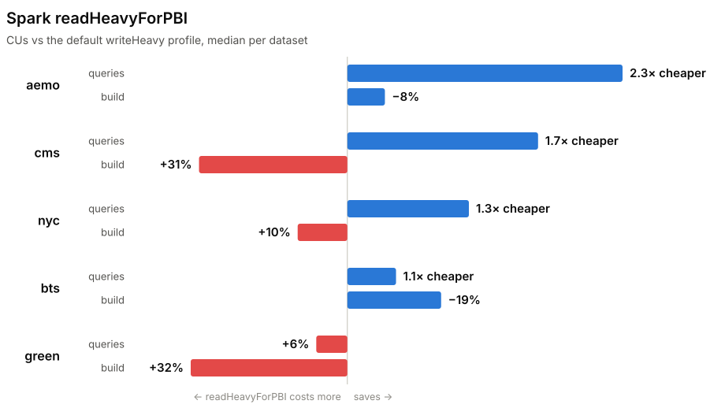

# Write parquet that Power BI likes

Power BI **Direct Lake** opens a Delta table's parquet directly. The first (cold) query
transcodes each parquet **row group into a VertiPaq segment, one to one**; every query after
that scans the segments the transcoding produced. So query latency — and, more importantly,
**capacity-unit consumption** — is a property of how the parquet was written.

This repo measures exactly that, on real Fabric capacity: five datasets (84M–592M-row marts,
~1.1B rows in all), four writers producing the **same rows**, one semantic model and one DAX
suite over each, capacity units (the bill) as the primary metric. Results are live at
**<https://djouallah.github.io/direct-lake-parquet-layout/>**.

## The short version

Queries come in tiers — **cold** (first touch: transcode the parquet into VertiPaq), **warm and
hot** (scan the segments already resident) — and each write knob pays at a different tier:

| knob | cold — the transcode | warm / hot — the scan |
|---|---|---|
| row-group size | degrades as groups shrink: each group is one more dictionary merge and segment setup | degrades when groups are too *few*: the scan needs at least as many segments as it has threads |
| dictionary encoding, declared in the footer | the whole cost lives here | irrelevant — segments are VertiPaq-native by then |
| global sort (which is what V-Order's reorder is) | cheaper encode | keeps paying — VertiPaq inherits the row order |

The rules, each measured in a section below:

- **Row groups: millions of rows each — never a library default.** DuckDB's 122,880-row default
  reaching OneLake made the same table 3.5× slower cold. The two failure modes bound a wide
  plateau: on a 144M-row table, 144 groups of 1M was the only band in a 60-run sweep with
  measurably worse directlake CU, 9 groups of 16M starved the warm scan, and everything from ~10
  to ~73 groups was a statistical tie — so 2–6M rows per group clears both ends, with the big
  end favouring cold and the small end favouring hot.
  [Details](#1-row-groups-millions-of-rows-each-and-more-of-them-than-the-engine-has-threads)
- **Sort the table globally, by the columns your queries filter.** Most of what V-Order does,
  and the one knob that keeps paying when hot — the row order survives transcoding into the
  resident segments. Sort for the workload's run lengths, not for file size: a 30% smaller file
  bought zero query time.
  [Details](#2-sort-the-table-globally-by-what-your-queries-filter)
- **Keep dictionary encoding on every column — and make the footer say so.** The engine takes
  the cheap remap path only when the footer's `encoding_stats` prove a chunk is
  dictionary-encoded without decoding it; DuckDB's writer gained that one footer list in
  [duckdb#24957](https://github.com/duckdb/duckdb/pull/24957) and the PR measures a 142M-row
  dictionary string column's cold first-touch falling **10,857.5 → 689.3 ms** — same pages, ~15×
  on the transcode. Cold-only: once resident, the parquet encoding is out of the picture.
  [Details](#3-keep-dictionary-encoding-on-every-column--and-declared-in-the-footer)
- **Writing with a Fabric engine? Turn V-Order on.** On Spark only the `readHeavyForPBI`
  resource profile enables it — the default `writeHeavy` doesn't, and `readHeavyForSpark`
  doesn't despite the name — measured at up to **2.8× less directlake CU** for ~8% build CU. The
  Warehouse has it on by default; leave it.
  [Details](#writing-with-a-fabric-engine-turn-v-order-on)
- **File count and file size don't matter.** Direct Lake does no file or row-group skipping at
  load, so they never separated engines in the CU data. The one file rule is a floor, not a
  target: never cap a file below one row group's bytes, or the writer truncates the group.
  [Details](#what-doesnt-matter-file-count-and-file-size)

Spark is the common writer, so its chart comes first — per dataset, `readHeavyForPBI`'s
directlake-CU saving against its build-CU delta, relative to the default `writeHeavy`; exact
figures in
[the second learning](#the-second-learning-the-write-optimised-profile-doesnt-optimise-the-write):

<picture>
  <source media="(prefers-color-scheme: dark)" srcset="docs/spark-profiles-dark.svg">
  
</picture>

One disclosure before the numbers: **most real traffic is hot.** A live model transcodes once
per reframe or memory eviction and serves from RAM after; this benchmark deploys a fresh model
every run, so cold is fully represented. Read the cold numbers as the price of first touch, the
hot numbers as what users feel all day, and weight the rules by which one your capacity actually
pays for.

## How the scan pays for your layout

What a cold query does, per [Microsoft's own account][dl-perf]:

1. The formula engine plans the DAX and issues storage-engine queries.
2. For each column touched and not yet resident, the engine merges that column's per-row-group
   parquet dictionaries into **one global VertiPaq dictionary** — work proportional to
   row-group count, done before the scan can run.
3. If the query joins tables, it builds a **join index per relationship**, which itself loads
   the key columns' dictionaries and the dimension key's segments — a star-schema cold query
   pays for the dimension too.
4. The scan runs across the segments, **remapping each segment's parquet data IDs onto VertiPaq
   IDs** on the way in — a cheap ID swap while the parquet side is dictionary-encoded, a full
   re-encode where it isn't.
5. A warm query on now-resident columns skips all of the above. Under memory pressure the
   engine unloads **segments and join indexes** and rebuilds them on the next query that needs
   them; a rewritten table (`OPTIMIZE`, overwrite) invalidates segments the same way.

The store this fills is the same VertiPaq engine import mode uses ([same page][dl-perf]), so
years of import-mode VertiPaq literature describe the scan too. Three consequences explain
almost every number below:

1. **The scan unit is the segment (= one row group), and the scan pool is sized by cores, not
   by segments.** Microsoft [lays out row groups to match the capacity's cores][dl-perf] and
   warns that uneven row-group sizes unbalance the scan — so a few giant row groups leave cores
   idle: on a 144M-row table, warm query time steps down between 19 and 24 row groups
   (≈5,700 ms → 3,221) and 72 row groups buy nothing over 24. Treat "more row groups than the
   engine has threads" as a floor, not a formula — a strict `ceil(segments ÷ threads)` cost
   model was tested with a deliberate 8-segment run and does not hold, consistent with fetch
   and transcode overlapping the scan.
2. **Cold cost scales with row-group count twice** — every row group is one more local
   dictionary in the merge (step 2) and one more segment to set up and remap (step 4) — so
   segments want **millions of rows each** ([Microsoft says 1–16M][dl-perf]). The same DuckDB,
   same notebook, same SQL was **3.5× slower cold** (96,503 ms vs 27,785) when a library
   default of 122,880 rows per row group reached OneLake: 1,172 tiny segments instead of ~25.
   ⚠️ Read that with the encoding result below it, though — when the same leg's row groups were
   later fixed at the source (3 files / 53 groups at 2.7M rows), its CU moved only ~15%. Segment
   count was the loud problem; the dictionary — and its footer declaration — was the expensive
   one.
3. **Within a segment the scan is run-length driven.** VertiPaq inherits the parquet row order
   during transcoding, and [VertiScan computes directly on the compressed data][dl-perf], so
   sorted data gives long RLE runs in the resident columns — which is why sorting speeds up
   warm and hot queries, not just the cold transcoding. This is also what V-Order mechanically
   is: a row-reordering plus encoding pass at write time.

Everything below is these facts applied.

[dl-perf]: https://learn.microsoft.com/en-us/fabric/fundamentals/direct-lake-understand-storage

## Writing with a Fabric engine? Turn V-Order on

V-Order is the sort-and-encode pass done for you, and its worth tracks **surface — column
count × categorical skew — not row count**: on the skewed 17-column taxi mart it collapsed the
most repetitive column to 3,371× fewer runs; on the near-unique 5-column AEMO mart it left row
order untouched and still shrank files 16%. It doesn't reorder what can't benefit, so it is
safe to leave on. Measured cost: ~8% of build compute CU (~14% on taxi); return: up to **2.8×
less directlake CU**.

- **Fabric Spark**: only the `readHeavyForPBI` resource profile enables it — the default
  `writeHeavy` turns it off, and `readHeavyForSpark` doesn't set it at all despite the name.
  Same data, same file band: V-Order on vs off is 1,332 vs 3,769 directlake CU. The profile also
  flips `optimizeWrite` to 1 GB bins, so on AEMO the *build* came out cheaper with V-Order on
  too — the default profile saves 7% of compute and spends 3.3× on OneLake writes to do it.
  [Second learning](#the-second-learning-the-write-optimised-profile-doesnt-optimise-the-write)
  has the numbers.
- **Fabric Warehouse**: on by default — leave it. `ALTER DATABASE … SET VORDER = OFF` is
  irreversible, and the one run measured with it off billed ~45% more directlake CU and wrote
  16% larger files (n=1 — indicative, not settled).

## Writing with a third-party writer?

delta-rs, DuckDB, open-source Spark, Iceberg writers — none has V-Order. Good practice with
any arbitrary parquet writer:

### 1. Row groups: millions of rows each, and more of them than the engine has threads

Never ship a parquet library's default row-group size to a Direct Lake table — declare
something in the millions. A sweep on the 144M-row table found the knee around **2–6M rows per
row group** (24–72 segments); 16M rows — copying V-Order's own segment size, VertiPaq's
ceiling — was the *worst* sorted geometry measured, because 9 segments starve the scan pool
(mechanic 1). The full sweep log lives in the
[`fct_summary` model header](models/aemo/duckdb/marts/fct_summary.sql).

The band has two ends because the tiers pull opposite ways, and each end's failure is measured.
Cold pays per row group twice (mechanic 2), so the transcode wants few big groups: directlake CU
over 60 runs of this table reads 1,561 at 8–10 row groups, 1,593 at 72–73, 1,765 at 19–27 —
a tie inside the run-to-run spread — and **2,190 at 144**, the one band that separates (its p25
clears every other band's p75). The warm scan wants segments ≥ threads (mechanic 1), which is
what ruled out the 9-segment geometry. Between those ends, ~10 to ~73 groups is a plateau where
neither tier can tell the difference — so if the model reframes rarely and serves hot traffic
all day, sit at the small-group end of the band; if cold first-touch dominates (frequent
reframes, many models per capacity), sit at the big end.

### 2. Sort the table globally, by what your queries filter

A global `ORDER BY` is most of the V-Order you can have (mechanic 3). Pick the key from the
query workload, not from what compresses best: here 9 of 25 queries filter on the date
dimension, so the key leads with `date`. The counterexample is measured — one alternative key
cut file size a further 30% (543 MB vs 778, n=4 per arm) and bought **statistically zero**
query time or CU. Sort for run lengths in the columns your queries touch; don't chase bytes.

### 3. Keep dictionary encoding on every column — and declared in the footer

Direct Lake remaps a parquet dictionary straight into VertiPaq's own — [documented][dl-perf] as
a direct remapping of parquet data IDs to VertiPaq IDs when both sides are dictionary-encoded;
a `PLAIN` column forces a re-encode from raw values at load. One 144M-row `DECIMAL(18,4)` column
measured 618.6 MB `PLAIN` vs 423.1 MB dictionary-encoded — ~200 MB and a rebuild-at-load on a
single column. Writers differ silently: Fabric's writers and delta-rs kept dictionaries
everywhere; OSS-profile Spark and DuckDB's own parquet writer dropped them on the widest columns,
exactly where it hurts — those are the two most expensive layouts here. Nothing warns you; read
the encodings back out of the footer. The knob is per writer and never called the same thing:
`dictionary_page_size_limit` bytes on delta-rs, `DICTIONARY_SIZE_LIMIT` distinct values on
DuckDB — both below.

**The declaration is part of the encoding.** The footer's `encoding_stats`
(`PageEncodingStats`) list is the only structure that lets a reader prove a chunk is entirely
dictionary-encoded *without decoding its pages*, and the remap-vs-re-encode decision is made
from it — a dictionary page the footer never declares still pays the re-encode. DuckDB's writer
emitted no `encoding_stats` at all until [duckdb#24957][ddb-estats] (merged 2026-08-24, in
`main` only), and that PR's own measurement is the sharpest number in this whole section: a
142M-row dictionary string column's cold first-touch at **10,857.5 ms** before the footer change
and **689.3 ms** after — same pages, one new footer list, ~15× on the transcode.

**And it is a cold-only cost.** Once transcoded, segments are VertiPaq's own store and the
parquet encoding is out of the picture; a `PLAIN` or undeclared column makes first touch
expensive, not every query. What survives into warm and hot is the row order (rule #2), never
the encoding.

[ddb-estats]: https://github.com/duckdb/duckdb/pull/24957

### A practical example: configuring the delta-rs writer

The three rules above, as an actual [delta-rs](https://github.com/delta-io/delta-rs) writer
profile — the one [duckrun ships as its default write layout][dr-layout], each value tuned
black-box against a Spark V-Order reference with DAX timings as the signal:

```python
from deltalake import write_deltalake, WriterProperties, ColumnProperties

# The row group is ADAPTIVE, not a constant: target ~8 groups so a table transcodes on
# several lanes, clamped into the 1M–16M segment band.
rg = max(1_000_000, min(16_000_000, -(-rows // 8)))   # ≥128M rows -> the 16M ceiling

wp = WriterProperties(
    compression="SNAPPY",                     # transcoding is decode-bound; ~1.3× ZSTD's size,
                                              #   paid once in storage vs decode on every cold load
    max_row_group_size=rg,                    # #1, in ROWS — a CEILING, so the file roll may close
                                              #   a group early; that is fine, tiny groups are not
    dictionary_page_size_limit=32 * 1024**2,  # #3 — THE knob. A column overflows to PLAIN when
                                              #   its dictionary outgrows this; the ~1 MB default
                                              #   is why writers drop the widest columns silently
    data_page_size_limit=1024**2,             # ~1 MB pages; page count is pure reader overhead
    data_page_row_count_limit=1_000_000,      # backstop: an ultra-compressible column otherwise
                                              #   buffers its whole row group as ONE page
    statistics_truncate_length=64,            # row-group min/max only; fat footers help nobody
    default_column_properties=ColumnProperties(
        dictionary_enabled=True, statistics_enabled="CHUNK"),
)
write_deltalake(path, table,                  # #2: ORDER BY your query-filter columns FIRST —
    writer_properties=wp,                     #   no writer property sorts for you
    target_file_size=1024**3)                 # a row group can't span files, so keep this well
                                              #   above one group's bytes (truncation trap below)
```

**`rows` is the whole problem** — see the closing note. A compaction reads it exactly from the
Delta log; a query being materialized has only an estimate, so duckrun raises the floor from 1M
to 8M on that path rather than trust it.

Two of these are worth restating. The dictionary page limit is the mechanism behind rule #3:
truly unique columns still overflow to PLAIN (correct — their dictionary would be as big as the
data), but the default limit silently de-dictionaries merely-wide columns, exactly the measured
~200 MB `PLAIN` case above; the cost of raising it lands on the *writer's* merge memory
(measured in duckrun's harness: an 18M-row merge at a 128 MB limit hit ~25 GB RSS, 8 MB ~4 GB),
not on the reader. And the statistics stay minimal because Direct Lake
[never reads them at load][dl-perf] — chunk-level min/max is for the other engines sharing the
table.

[dr-layout]: https://djouallah.github.io/duckrun/parquet-layout.html

### And with DuckDB's own writer, where the defaults cost the most

DuckDB writing parquet directly was the worst measured layout in this repo, and both mechanics
failed from the same [documented default][ddb-copy]: `ROW_GROUP_SIZE` is **122,880 rows**. That
reached OneLake intact on the iceberg leg — 1,172 row groups, 122,851 rows each, **96,503 ms
cold** against the same DuckDB in the same notebook writing through delta-rs at 27,785 ms.

The second failure is downstream of the first, and it is the answer to "how do I keep every
column dictionary-encoded": **`DICTIONARY_SIZE_LIMIT` defaults to `ROW_GROUP_SIZE / 5`** — 24,576
distinct values at the default geometry. A column with more distinct values than that *inside one
row group* falls back to `PLAIN`. That is exactly the column from rule #3: read back off this
table's own footers, `mw` carried **0 dictionary pages across all 1,172 chunks** while every other
column kept `PLAIN_DICTIONARY` — one column, one derived default, ~200 MB and a rebuild-at-load.

**THE ROW GROUP IS FIXED UPSTREAM NOW, AND THAT SEPARATED THE TWO MECHANICS CLEANLY.** DuckDB
`1.6.0.dev365` reworked the iceberg writer; the leg pins it, and run 32444969823 wrote the same
143,980,961 rows as **3 files / 53 row groups at 2.7M rows** — in family with delta-rs's 9–73 and
Spark's 10–11, on identical bytes (1,129 MB against 1,119). So geometry stopped being the variable.
**The cost barely moved**: directlake CU 9,288 → 7,923, about −15%, against delta-rs's 1,618–3,903.

What is left is the encoding, and the bigger row group only half-fixed it. `mw` now carries a
dictionary page on **43 of 53 chunks** instead of 0 of 1,172 — but 10 chunks still fall to raw
`PLAIN`, and iceberg remains the only writer here emitting **no RLE at all** on the indices:

| writer | `mw` encodings | chunks with a dict page | `mw` |
|---|---|---:|---:|
| delta-rs (duckrun) | `PLAIN+RLE+RLE_DICTIONARY` | 25/25 | 418.1 MB |
| Fabric Warehouse | `PLAIN+RLE+RLE_DICTIONARY` | 73/73 | 454.2 MB |
| Spark | `PLAIN_DICTIONARY+RLE` | 15/15 | 420.5 MB |
| DuckDB → Iceberg | `PLAIN+PLAIN_DICTIONARY` | 43/53 | 483.9 MB |

Read that as the point of this whole section rather than a footnote about one adapter: **a plain
dictionary is what the engine on the other side wants, and everything else is a rebuild at load.**
Segment count was the loud problem and it was never the expensive one.

**The encoding half is now fixed upstream too — and the fix is a footer list, not a new
encoder.** [duckdb#24957][ddb-estats] (merged 2026-08-24) makes DuckDB's writer emit
`encoding_stats`, the declaration rule #3 turns on. Until it, no DuckDB-written chunk — dictionary
page or not — could be *proven* dictionary-encoded without decoding it, which is the likely
reason fixing the geometry moved this leg's CU only ~15%: the 43 chunks that did carry a
dictionary were still undeclared. The PR's measurement of what the one footer list is worth:
cold first-touch of a 142M-row dictionary string column, **10,857.5 → 689.3 ms**. It is in no
release — stable is 1.5.5, the fix lives in `main` (v2.0.0-alpha) — and the wheel this leg pins
predates it, so no benchmark run here carries it yet. The dispatch-only `DuckDB main smoke`
workflow watches for a build that does (it loads iceberg against OneLake and asserts the written
parquet's `encoding_stats` declare a dictionary page); when a wheel ships it, the pin moves and
the iceberg column should finally close on the others.

```sql
COPY (SELECT * FROM fct_summary ORDER BY date, time, price)  -- #2: sort is yours to do
  TO 'fct_summary.parquet' (
    FORMAT parquet,
    COMPRESSION snappy,
    ROW_GROUP_SIZE 6_000_000,                  -- #1: 122,880 is the default that cost 3.5×
    DICTIONARY_SIZE_LIMIT 2_000_000,           -- #3: in DISTINCT VALUES, not bytes.
                                               --     NEVER 0 — that DISABLES dictionaries
    STRING_DICTIONARY_PAGE_SIZE_LIMIT 32_000_000,  -- the byte cap; both must clear (default 1 MB)
    DATA_PAGE_SIZE_LIMIT 1_048_576             -- needs the next release, see below
);
```

Raising the row group partly fixes the dictionary for free, since the limit is *derived* from it —
at 6M rows the default limit becomes 1.2M distinct values — but set it explicitly, because the
derivation is the trap: nobody tuning segment size expects to be changing column encodings. Two
values worth not guessing at: `0` **disables** dictionary encoding rather than unbounding it, and
the byte cap is separate, so a wide string column can still overflow at 1 MB while clearing the
distinct-value limit.

The whole mechanism reproduces offline in five lines — no Fabric, no capacity — and reading the
encodings back is the only way to see any of it:

```python
import duckdb
c = duckdb.connect()
c.sql("create table t as select i::int id, (i%50000)::bigint mid from range(600000) tbl(i)")
c.sql("copy t to 'a.parquet' (format parquet)")                              # defaults
c.sql("copy t to 'b.parquet' (format parquet, row_group_size 600000)")       # one knob
c.sql("select path_in_schema, any_value(encodings) from parquet_metadata('a.parquet') group by 1")
```

`a.parquet` writes `mid` as `PLAIN` — 50,000 distinct values against the derived 24,576 limit — and
`b.parquet` recovers the dictionary having touched nothing but the row-group size. Do this against
your own table before and after; the footer is the only channel that reports what you actually got.

**Don't blanket-raise it, though**, and the same repro shows why: pushing
`DICTIONARY_SIZE_LIMIT` past the *unique* `id` column's cardinality dictionary-encodes that too
and the file grows 4.82 MB → 6.43 MB. A near-unique column's dictionary is as large as the data,
which is why every writer here overflows to `PLAIN` eventually and should. Aim the limit at the
mid-cardinality columns the default is silently losing, not at every column in the table.

**The last gap closes in the next DuckDB release.** Data pages were split only at a hardcoded
100 MB uncompressed threshold, "often producing a single huge page per column chunk";
[duckdb#24645][ddb-pr] adds the `DATA_PAGE_SIZE_LIMIT` option above (merged 2026-08-10, motivated
explicitly by downstream readers needing page-level granularity). The default stays 100 MB, so it
has to be passed, and it is not in a release yet — DuckDB 1.5.5 answers
`Unrecognized option "data_page_size_limit" for parquet`. It measures uncompressed bytes, which is
why it needs no row-count backstop alongside it — unlike delta-rs, whose cap is checked on
*encoded* bytes and therefore ships `data_page_row_count_limit` too.

**None of these knobs is reachable from dbt-duckdb** — they are `COPY` options and that adapter
exposes no writer config at all — so the iceberg leg gets whatever the DuckDB build does by default.
That used to mean 122,880 and the outlier row-group count; `1.6.0.dev365` moved the default and the
leg pins it, which is why the geometry is now in family and the *encoding* is what is left. The
knobs are still worth knowing for a DuckDB you drive yourself; the leg here cannot pass them.

Two routes exist if it ever needs to. DuckDB's iceberg extension honours the Iceberg **table
properties** `write.target-file-size-bytes` and `write.parquet.row-group-size-bytes` (settable at
`CREATE TABLE … WITH (…)`, or afterwards via `set_iceberg_table_properties()`, which a dbt
`post_hook` can call) on unpartitioned tables — they raise on partitioned ones, suppressible with
`ignore_row_group_size_for_partitioned_tables`. There is **no** equivalent for the sort: Iceberg's
own `sort-orders` metadata is not exposed by the extension ([duckdb-iceberg#1292][ddb-ice-sort] is
open), and per its own author declaring one would not sort the data anyway.

[ddb-ice-sort]: https://github.com/duckdb/duckdb-iceberg/pull/1292

[ddb-copy]: https://duckdb.org/docs/current/sql/statements/copy.html
[ddb-pr]: https://github.com/duckdb/duckdb/pull/24645

### What doesn't matter: file count and file size

File count never separated engines in the CU data — the Warehouse ships 78 files and sits
mid-pack; the pre-fix iceberg leg shipped ~357 and lost on its *segments*. A 30% smaller file bought no
query time (four separate demonstrations in the log). Both agree with the documentation:
[Direct Lake does no statistics-based file or row-group skipping at load][dl-perf], so a
smaller or cleverly-partitioned file elides no reads — the sort pays through run lengths
(mechanic 3), never through skipping. One trap: **delta-rs truncates the in-progress row group
at the file-size cap** (measured writing groups at 0.43× their declared rows) — a truncated
group is not just small, it makes segment sizes uneven, which is exactly the
[non-uniform scan load][dl-perf] the docs warn about. Keep the cap comfortably above one row
group's bytes and control size with the row-group knob, not the file knob.

## The lab

Five datasets, chosen to span the surface layout acts on — skew, competing skew, width,
sparsity — plus one deliberate near-zero-surface control, because that control alone once
produced a confidently wrong answer about V-Order:

| dataset | source | mart | shape |
|---|---|---|---|
| `aemo` | Australian electricity market, ragged CSV from nemweb | `fct_summary` — 144M rows, **5 narrow columns** | regular 5-min × unit grid, near-uniform — the control |
| `nyc` | NYC yellow-taxi trips, monthly parquet from TLC's CDN | `fct_trips` — 592M rows, **17 columns** | extreme skew: categoricals at 97–99% one value, two Zipfian zone ids |
| `bts` | US on-time flights, monthly zipped CSV from TranStats | `fct_flights` — 180M rows, **22 columns** | independent *moderate* skew — many categoricals competing for one sort budget |
| `green` | NYC green-taxi trips, monthly parquet from TLC's CDN | `fct_green_trips` — 84M rows, **20 columns** | nyc's skew regime at 1/7 the rows |
| `cms` | CMS Open Payments, annual CSV | `fct_cms_payments` — 88M rows, **91 columns** | wide and sparse — **54 columns >50% NULL** — with both skew regimes in one table |

Four writers produce the same rows from the same landed files, selected by dbt target — the
parquet each writes is the only variable:

| target | engine | parquet writer |
|---|---|---|
| `duckrun` | DuckDB in a Fabric notebook | delta-rs |
| `iceberg` | the same DuckDB, same notebook | DuckDB's writer, via an Iceberg REST catalog |
| `dwh` | Fabric Warehouse (T-SQL) | the warehouse's own (V-Order) |
| `spark` | Fabric Spark (Livy) | parquet-mr (V-Order per resource profile) |

**Measurement:** one `.bim` per engine per dataset and one ~25-query DAX suite per dataset,
Direct Lake with fallback disabled (a query it can't serve fails, rather than quietly running on
the SQL endpoint), deployed fresh so pass 1 is genuinely cold, pass 2 warm, the rest hot
(median). CU is read per item GUID from Fabric's own Capacity Metrics model. Detail: [benchmark/README.md](benchmark/README.md) and
[dashboard/README.md](dashboard/README.md).

## Method and limits

VertiPaq is treated as a black box: one write knob changes per experiment pair, the layout is
**read back from the parquet footers and Delta log** rather than trusted from config (twice a
declared setting was silently dropped by a writer and only the read-back caught it), the bill
is the metric, and negative results and retractions stay in the record — "V-Order does not
reorder rows" was written down, overturned by the second dataset, and retracted in place.
Every mechanical claim in this document is either one of these black-box measurements (the
number is stated in place) or linked to public documentation — see
[References](#references).

Read the numbers as measurements, not laws:

- **Five datasets** span the surface axis — skew, competing skew, width, sparsity; your table
  still sits somewhere else on it.
- **One ~25-query DAX suite per dataset** — a different workload weights the columns, and
  therefore the sort key, differently.
- **The design over-weights cold.** Every dispatch deploys a fresh model and measures each
  query's first touch; a live model transcodes once per reframe or eviction and serves hot
  after, so its traffic is overwhelmingly hot. The cold and CU numbers price first touch, not
  steady state.
- **Some cells are thin** — the Warehouse V-Order-off result is one run, and CU on a shared
  capacity is noisy: one dispatch read 2,629 directlake CU on parquet byte-identical to runs
  reading ~1,330–1,590.
- **The Spark V-Order pair compares resource profiles**, not the encoder alone —
  `optimizeWrite` bin size moves with it.
- **Everything here is Direct Lake / VertiPaq.** A different reader pays for parquet
  differently; these findings do not transfer.

## The biggest learning: a planner estimate is a guess

Adaptive row-group sizing needs to know how many rows are about to be written, and when the
writer is **materializing a query**, nobody does. DuckDB's planner estimated ~14.9M rows for the
143,980,961-row mart above — 9.7× low — and the same class of miss on a 370M-row fact produced
380 row groups where ~34 belong. The causes are structural: a fixed 0.2 selectivity guess for
filters and anti/semi joins, set-operation parents carrying no cardinality of their own, CSV
sources extrapolated from *file size*.

The miss is asymmetric, which is why it needs a fallback rather than a better guess: an
over-estimate is harmless (it caps at the 16M ceiling and the file roll decides), while an
under-estimate pins a huge table to the bottom of the band **and it stays there**. So the floor
is raised for estimates — never below 8M from a guess, versus 1M from an exact Delta-log count —
and a model that knows its own size declares it instead.

## The second learning: the write-optimised profile doesn't optimise the write

Fabric Spark's default resource profile is `writeHeavy`, and on this evidence it is the wrong
default for anything Power BI reads. It does save Livy compute — and then hands the saving
straight back at the storage counter, before costing a multiple of it again on every query.

The table below is **regenerated from the run records every time the CU ledger is topped up**, so
it is never staler than the ledger under it:

<!-- spark-profiles:start -->

| dataset | profile | build | build&nbsp;% | directlake | query&nbsp;% | rows | avg row group | table size (MB) |
|---|---|---:|---:|---:|---:|---:|---:|---:|
| aemo | `readHeavyForPBI` | **32,886** | 100% | **1,566** | 100% | 144.0M | 9.6–16.0M | 4,338–4,350 |
| aemo | `writeHeavy` | **35,805** | 109% | **3,675** | 235% | 144.0M | 6.5–11.1M | 5,691–5,752 |
| bts | `readHeavyForPBI` | **3,053** | 100% | **938** | 100% | 180.5M | 6.7M | 2,585 |
| bts | `writeHeavy` | **4,076** | 134% | **1,093** | 117% | 180.5M | 6.9M | 2,441 |
| cms | `readHeavyForPBI` | **9,881** | 100% | **1,143** | 100% | 87.7M | 1.6M | 3,032–3,033 |
| cms | `writeHeavy` | **7,485** | 76% | **2,043** | 179% | 87.7M | 1.3M | 5,582 |
| green | `readHeavyForPBI` | **1,990** | 100% | **2,741** | 100% | 84.3M | 2.3M | 1,546 |
| green | `writeHeavy` | **1,493** | 75% | **2,644** | 96% | 84.3M | 3.4M | 1,623 |
| nyc | `readHeavyForPBI` | **11,837** | 100% | **6,348** | 100% | 591.7M | 5.7–10.4M | 5,850–5,867 |
| nyc | `writeHeavy` | **11,052** | 93% | **8,652** | 136% | 591.7M | 5.8–10.4M | 9,200–9,291 |

V-Order (measured off the parquet, not the profile name): `readHeavyForPBI` yes, `writeHeavy` no. Dictionary encoding survived — no mart column fell back to PLAIN data pages (dictionary overflow, what makes a segment expensive to transcode): `readHeavyForPBI` yes (cms no), `writeHeavy` no (bts yes).

<!-- spark-profiles:end -->

The chart of these rows sits at the top of the page, under
[The short version](#the-short-version).

The storage column is almost entirely one operation, `OneLake Write via Redirect`, and its cause is
published rather than inferred: Microsoft's [resource profile reference][ms-profiles] gives
`readHeavyForPBI` `optimizeWrite.enabled: "true"` at `binSize: "1g"` while `writeHeavy` doesn't
enable it and sets `binSize: "128"`. Few large coalesced writes against many small ones — which is
also why the file counts separate. `readHeavyForSpark` is the same trap wearing a better name: a
little cheaper to build, roughly twice the directlake CU, and it sets no V-Order at all.

**Read the datasets apart rather than pooling them.** On aemo the storage penalty is large enough
to make the "write-optimised" build the *dearer* one outright; on nyc it doesn't appear and
`writeHeavy` genuinely does build cheaper. What survives both is the claim worth keeping: **the
build saving is small and can be negative, while the directlake penalty is a multiple.** Either way
the total favours `readHeavyForPBI`.

Note what this does *not* say. Capacity Metrics bills operation duration × capacity units and
exposes no CPU-utilisation signal, so nothing here explains what the compute was doing or why.
The measurable statement is narrower and sufficient: the profile moves cost out of compute and
into separately billed storage operations, at a rate that loses.

[ms-profiles]: https://learn.microsoft.com/en-us/fabric/data-engineering/configure-resource-profile-configurations

## Where to read further

- the [live dashboard](https://djouallah.github.io/direct-lake-parquet-layout/) — every run,
  cost and speed per layout
- [RETROSPECTIVE.md](RETROSPECTIVE.md) — what the exercise cost, and what would make it cheaper
- [`fct_summary.sql`](models/aemo/duckdb/marts/fct_summary.sql) — the lab notebook: row-group
  sweeps, sort keys, the delta-rs truncation measurement
- [LEARNINGS.md](LEARNINGS.md) — dbt-adapter and engine war stories (*not* layout)
- [TODO.md](TODO.md) — open questions, with the cost of answering each
- [docs/RUNNING.md](docs/RUNNING.md) — run it yourself, offline in DuckDB or against Fabric
- [docs/CI.md](docs/CI.md) — how CI runs this against Fabric, OIDC setup
- [CLAUDE.md](CLAUDE.md) — the working rules, for anyone changing the project

## References

Public documentation grounding the mechanics above; every other claim is a measurement from
this repo's own runs (`history/runs/`, the model-header sweep logs, the
[dashboard](https://djouallah.github.io/direct-lake-parquet-layout/)).

- [Understand Direct Lake query performance](https://learn.microsoft.com/en-us/fabric/fundamentals/direct-lake-understand-storage)
  (Microsoft Learn) — the cold-query pipeline: local→global dictionary merge, parquet-ID→
  VertiPaq-ID remapping and the `PLAIN` re-encode cost, join indexes and what building one
  loads, segments and join indexes unloading under memory pressure, 1–16M-row segment guidance,
  row groups laid out to match cores, non-uniform scan load, and that no parquet/Delta
  statistics are used for skipping at load.
- [Direct Lake overview](https://learn.microsoft.com/en-us/fabric/fundamentals/direct-lake-overview)
  and [How Direct Lake works](https://learn.microsoft.com/en-us/fabric/fundamentals/direct-lake-how-it-works)
  (Microsoft Learn) — framing, transcoding on demand, cold/semiwarm/warm/hot, guardrails.
- [Delta Lake table optimization and V-Order](https://learn.microsoft.com/en-us/fabric/data-engineering/delta-optimization-and-v-order)
  (Microsoft Learn) — V-Order as a write-time sort-and-encode pass.
- Import-mode VertiPaq internals — applicable because Direct Lake fills the same in-memory
  store (first reference): [SQLBI's VertiPaq material](https://www.sqlbi.com/topics/vertipaq/)
  and *The Definitive Guide to DAX* on segments, dictionaries and relationship structures, plus
  the [`DISCOVER_STORAGE_TABLE_COLUMN_SEGMENTS` DMV](https://learn.microsoft.com/en-us/analysis-services/instances/use-dynamic-management-views-dmvs-to-monitor-analysis-services)
  that exposes per-segment residency and temperature on a live model.
- [duckrun's parquet layout page](https://djouallah.github.io/duckrun/parquet-layout.html) —
  the delta-rs writer profile above, with the measured rationale per property (SNAPPY vs ZSTD,
  the dictionary-limit / merge-memory trade, page caps) and the black-box tuning loop against a
  Spark V-Order reference.
- [DuckDB `COPY` parquet options](https://duckdb.org/docs/current/sql/statements/copy.html)
  — every default quoted above: `ROW_GROUP_SIZE` 122,880, `DICTIONARY_SIZE_LIMIT`
  `ROW_GROUP_SIZE / 5` (`0` disables), `STRING_DICTIONARY_PAGE_SIZE_LIMIT` 1 MB.
  [duckdb#24645](https://github.com/duckdb/duckdb/pull/24645) adds `DATA_PAGE_SIZE_LIMIT`;
  [duckdb#24957](https://github.com/duckdb/duckdb/pull/24957) makes the writer emit
  `encoding_stats` (`PageEncodingStats`) and carries the 10,857.5 → 689.3 ms cold first-touch
  measurement quoted above.
